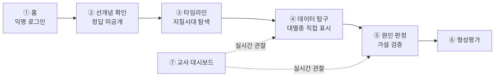

# 대멸종의 원인을 찾아라

고등학교 1학년 『통합과학2』 「변화와 다양성」 단원 — **지질시대와 대멸종**을 다루는 2차시 탐구 수업용 웹 애플리케이션입니다.

> **https://geo-extinction.netlify.app** ← 바로 열어 보실 수 있습니다

학생이 실제 고생물학·고기후 데이터를 직접 읽고, 대멸종의 원인에 대한 네 가지 가설을 모둠별로 판정합니다. 교사의 설명을 듣는 대신 **학생이 자료를 근거로 결론을 내리고, 그 결론을 학급 전체와 실시간으로 비교**합니다.

2026 여름 [마이크로 디그리] 융합교육을 위한 기초 프로그래밍 — 프로젝트 2

---

## 제출 문서

| 문서 | 내용 |
|---|---|
| **[프로젝트 계획안](프로젝트-계획안.md)** | 수업 설계(성취기준·차시별 내용·평가) + 웹앱 기획서(페르소나·사용자 스토리·스토리 맵핑) |
| **[발표자료](발표자료.html)** | 10분 발표용 슬라이드 12장 · **내려받아 브라우저로 열어야 합니다** ([바로 보기](https://htmlpreview.github.io/?https://github.com/daunk88830-glitch/geo-extinction/blob/main/발표자료.html)) |
| **[앱 설명서](앱-설명서.md)** | 화면 흐름, 기술 구조, 동시 접속 설계, 개인정보 처리 |

---

## 이 앱이 하는 일

교과서 그래프를 다시 그린 것이 아니라 **국제 학술 데이터베이스의 원자료**를 가공해 넣었습니다. 종이 활동지로는 할 수 없는 세 가지를 담당합니다.

- **실제 데이터의 대화형 판독** — 98개 구간의 다양성 곡선과 85개 지점의 기온·CO₂ 자료를 손가락으로 훑으며 읽습니다
- **학급 전체 판단의 실시간 집계** — 학생이 표시한 대멸종 구간이 즉시 히트맵으로 누적됩니다
- **학습자 응답에 따른 내용 재구성** — 학급의 오개념 분포에 따라 안내 카드 순서가 바뀝니다

### 설계에서 가장 중요한 부분

20개 칸(사건 5 × 가설 4)의 **증거 강도를 일부러 균등하지 않게** 구성했습니다.

- 사상 최대 규모인 대멸종에 **소행성 충돌의 증거가 없습니다**
- 어떤 사건은 큰 크레이터가 실제로 있지만 **연대가 약 1,300만 년 어긋납니다**
- 다섯 사건 **모두**에 증거가 약하거나 없는 가설이 하나 이상 있어, 어느 사건을 맡든 **모든 모둠이 "기각"을 한 번은 경험**합니다

"이 가설은 이 사건을 설명하지 못한다"는 결론을 **정당한 과학적 판정으로 인정**합니다. 모든 판정 항목에 *"판단 보류 — 지금 자료로는 정할 수 없다"* 를 두었습니다.

---

## 화면 흐름



| 화면 | 하는 일 |
|---|---|
| ① 홈 | 반(1~9)·모둠(1~5)·이름 입력 → 익명 로그인 |
| ② 선개념 확인 | 5문항 3지선다, **정답 미공개**. 학급 오개념 분포를 계산해 다음 화면을 재구성 |
| ③ 타임라인 | 시대별 세로 길이가 실제 지속 기간에 비례 (선캄브리아시대 88.2%) |
| ④ 데이터 탐구 | 다양성·화석 기록 수·기온·CO₂ 네 그래프가 시간축 공유. 구간 직접 표시 → 학급 히트맵 |
| ⑤ 원인 판정 | 한 모둠이 사건 하나 담당 → 네 가설 검토 → 하나 골라 기준 4개로 판정 → AI 반론 → 재반박 |
| ⑥ 형성평가 | 선택형 + 서술형(AI 루브릭 피드백), 선개념 사전-사후 비교 |
| ⑦ 교사 대시보드 | 오개념 분포, 히트맵, 모둠별 진행, 답안 AI 군집 분류 |

---

## 30명 동시 접속 설계

교실에서 30명이 **같은 순간에** 데이터를 씁니다. 이 조건이 설계를 결정했습니다.

| 문제 | 해결 |
|---|---|
| 카운터 문서 하나에 30명의 쓰기가 몰려 병목 | **카운터를 만들지 않음.** 표시를 `{uid}_{구간}` 문서로 분리하고 클라이언트에서 셈 |
| 두 모둠이 같은 사건을 동시에 선택 | 사건 점유를 **create 전용**으로 제한 → 먼저 누른 모둠이 이기는 것을 서버가 보장 |
| 같은 모둠원 여러 명이 동시 편집 | 항상 `merge` 로 부분 저장. 입력 중인 칸은 화면 갱신에서 제외 |
| 학교망이 WebSocket 차단 | Firestore `experimentalAutoDetectLongPolling` |
| 저장 실패가 조용히 넘어감 | 실패를 **반드시 화면에 표시** (개발 중 실제로 겪은 문제) |

보안 규칙은 [`firestore.rules`](firestore.rules)에 있습니다. 문서 이름 앞부분이 본인 uid 인 문서만 쓸 수 있고, 학생은 다른 학생의 평가 답안을 열람할 수 없습니다.

---

## 데이터 출처

| 자료 | 출처 | 규모 |
|---|---|---|
| 생물 다양성 곡선 | [Paleobiology Database](https://paleobiodb.org), CC BY 4.0 | 98개 구간, 538.8 → 0.012 Ma |
| 전 지구 평균 기온·CO₂ | Judd, E. J. et al. (2024), *Science* 385, eadk3705 — [PhanDA](https://github.com/EJJudd/PhanDA) | 85개 지점, 482 → 0.006 Ma |
| 지질시대 구분·연대 | 국제층서위원회(ICS) 국제층서도표 2023, [stratigraphy.org](https://stratigraphy.org) | — |
| 대멸종 5회 구분 | 비상교육 『통합과학2』 p.20 (원출처: 『지구환경과학』, 2012) | 5개 사건 |
| 시대별 환경·생물 서술 | 비상교육 『통합과학2』 pp.18-19 | — |

> 482백만 년 전 이전은 기온·CO₂ 복원 자료가 **존재하지 않아 비워 두었습니다.** 임의로 채우지 않고 "자료 없음"으로 표시합니다.

---

## 기술 구성

| 구분 | 기술 |
|---|---|
| 빌드 | Vite 8 |
| 프론트엔드 | **Vanilla JavaScript** (ES 모듈) — 프레임워크 없음 |
| 그래프 | Chart.js |
| 인증·DB | Firebase (익명 인증 + Firestore) |
| 호스팅·함수 | Netlify (+ Netlify Functions) |
| AI | Claude API — 반론 생성 / 서술형 피드백 / 오개념 군집 분류 |

프레임워크를 쓰지 않은 이유는 30명이 학교 와이파이로 동시에 접속하기 때문입니다. **초기 로딩 용량이 곧 수업 시작 시간**이라, 화면을 동적 import 로 나누어 첫 화면이 빨리 뜨게 했습니다.

AI는 *있으면 좋은 것*이지 *없으면 멈추는 것*이 아닙니다 — 12초 제한 → 1회 재시도 → 실패 시 미리 준비된 반론으로 대체하고 수업은 계속 진행됩니다.

---

## 로컬에서 실행하기

```bash
npm install
cp .env.example .env.local     # Firebase 설정값 6개를 채웁니다
npm run data                   # data-raw/ → public/data/ 학생용 데이터 생성
npm run dev                    # http://localhost:5173
```

`.env.local` 없이도 실행됩니다. 이때는 Firebase 없이 동작하며 데이터가 브라우저에만 남습니다.

| 명령 | 하는 일 |
|---|---|
| `npm run dev` | 개발 서버 |
| `npm run data` | 원자료 → 학생용 JSON 생성 (**정답표 자동 제거**) |
| `npm run images` | 시대별 배경 이미지 생성 |
| `npm run build` | 배포용 빌드 |
| `npm run rules` | Firestore 보안 규칙 배포 (최초 1회 `npm run rules:login`) |

### 정답표 보호

`data-raw/hypotheses.json` 에는 증거 강도·정답 기준·교사 지도 노트가 들어 있습니다. `npm run data` 가 **이 항목들을 제거한 학생용 파일**을 `public/data/` 에 만들고, 배포에는 그 파일만 올라갑니다. Netlify 빌드 명령에도 `npm run data` 가 포함되어 있어 원본을 고치고 깜빡해도 정답표가 새어 나가지 않습니다.

---

## 폴더 구조

```
src/
  main.js          앱 시작점, 화면 등록
  router.js        해시 라우터
  store.js         전역 상태 (구독 방식)
  firebase.js      Firebase 초기화, 학급 세션 결정
  views/           화면 7개
  components/      그래프 묶음, 레이더 차트, 삽화
  services/        인증 · 표시 · 판정 · 평가 · 교사 · AI 호출
  data/            문항 데이터, 데이터 로더
  styles/          화면별 스타일
netlify/functions/ 서버리스 함수 3개
scripts/           원자료 가공 (데이터 · 이미지)
data-raw/          교사용 원본 (배포에 포함되지 않음)
firestore.rules    보안 규칙
```

---

## 한계

- **30대 동시 접속은 설계상 대비일 뿐, 교실 와이파이에서 실측하지 못했습니다**
- AI 응답 품질은 학생이 쓴 근거의 구체성에 크게 좌우됩니다
- 형성평가 문항이 아직 표본 수준입니다 (구글 시트 연동으로 확장 예정)
- 모둠을 색으로 구분하는 부분에 색각 이상 보조 표시가 필요합니다
- 다양성 곡선의 해상도가 구간당 약 5백만 년이라, 짧은 기간의 사건은 완만하게 보입니다

---

## 교육과정 표기 규칙

교사용 지도서의 지침을 앱 전체에 적용했습니다.

- 학생 화면에는 **대(代) 수준 표기만** 사용합니다 (예: "고생대 말 대멸종")
- 기(紀) 명칭과 정확한 연대는 **「심화 보기」 안에만** 둡니다
- 그래프 시간축의 연대 표시는 자료 판독에 필요하므로 허용하되, 암기 대상으로 삼지 않습니다
- 표준화석 이름도 암기를 요구하지 않습니다
