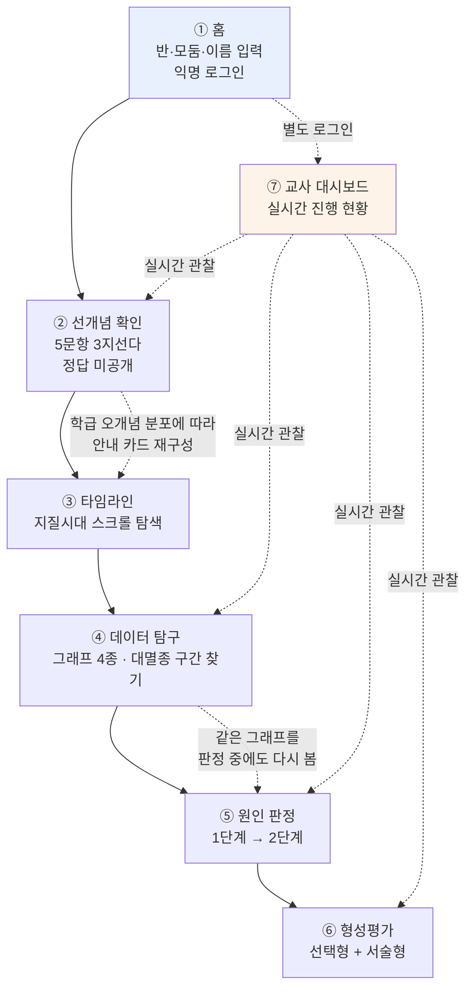

# 지질시대와 대멸종 — 웹 기반 탐구 수업 도구

고등학교 1학년 『통합과학2』 「지질시대와 대멸종」 단원 수업용 웹 애플리케이션

- 주소: https://geo-extinction.netlify.app
- 개발 기간: 2026년 7월 30일 ~ 8월 1일
- 소스 규모: 약 7,400줄 (JavaScript + CSS)

---

## 1. 한 줄 요약

학생이 **실제 고생물학·고기후 데이터를 직접 읽고**, 대멸종의 원인에 대한 네 가지 가설을 **모둠별로 판정하는** 탐구 수업 도구입니다. 교사의 설명을 듣는 대신 학생이 자료를 근거로 결론을 내리고, 그 결론을 학급 전체와 비교합니다.

---

## 2. 개발 배경

### 기존 수업의 문제

이 단원은 교과서에서 **암기 과목처럼 다뤄지기 쉽습니다.** 지질시대의 이름, 각 시대의 표준화석, 다섯 번의 대멸종 시기를 외우는 방식입니다. 그러나 성취기준이 요구하는 것은 암기가 아니라 **자료 해석과 근거 기반 추론**입니다.

또 하나의 문제는 **"모든 가설은 나름 타당하다"는 잘못된 상대주의**입니다. 대멸종의 원인으로 여러 가설을 나열하고 끝내면, 학생은 어느 가설이든 그럴듯하다고 배웁니다. 실제 과학에서는 사건마다 증거의 강도가 크게 다릅니다.

### 이 앱의 접근

1. **실제 데이터를 준다** — 교과서 그래프를 다시 그린 것이 아니라, 국제 학술 데이터베이스의 원자료를 가공해 넣었습니다.
2. **증거의 불균등함을 숨기지 않는다** — 어떤 사건-가설 조합은 증거가 아예 없습니다. 학생이 "이 가설은 이 사건을 설명하지 못한다"는 결론에 도달하는 것을 **정당한 과학적 판정으로 인정**합니다.
3. **판단을 유보할 수 있게 한다** — 모든 판정 항목에 "판단 보류 — 지금 자료로는 정할 수 없다"를 두었습니다.

---

## 3. 사용 환경

| 항목 | 내용 |
|---|---|
| 대상 | 고등학교 1학년 (통합과학2) |
| 학급 규모 | 학급당 약 30명 × 9개 학급 |
| 모둠 구성 | 학급당 5모둠 (대멸종 사건이 5개이므로) |
| 학생 기기 | 개인 스마트폰 (설치 불필요, 주소만 접속) |
| 로그인 | 익명 로그인 — 계정 생성·이메일·비밀번호 없음 |
| 네트워크 | 학교 와이파이 |

30명이 **동시에** 접속해 **동시에 데이터를 쓰는** 것이 이 앱의 가장 큰 기술적 제약이었습니다. (8절 참조)

---

## 4. 화면 흐름도

### 다이어그램



### 텍스트 버전 (다이어그램이 안 보이는 경우)

```
[학생]
 ① 홈  ─ 반(1~9) · 모둠(1~5) · 이름 입력 → 익명 로그인
 ↓
 ② 선개념 확인  ─ 5문항 3지선다 (정답 미공개)
 ↓        └─→ 학급 오개념 분포를 계산해 다음 화면의 안내 카드를 바꿈
 ③ 타임라인  ─ 스크롤하며 지질시대 탐색 (배경 이미지 · 카드뉴스)
 ↓
 ④ 데이터 탐구  ─ 그래프 4종을 보고 대멸종 구간을 직접 표시
 ↓        └─→ 학급 전체의 표시가 히트맵으로 실시간 누적
 ⑤ 원인 판정  ─ 1단계: 네 가설 모두 검토
 ↓             2단계: 하나를 골라 기준 4개로 판정 → 반론 → 재반박
 ⑥ 형성평가  ─ 선택형 + 서술형, 선개념 응답과 사후 비교

[교사]
 ⑦ 교사 대시보드  ─ 별도 로그인, 위 모든 단계를 실시간 관찰
```

---

## 5. 화면별 설명

### ① 홈

학번·이름·**반**·**모둠**을 입력하면 Firebase 익명 로그인이 이뤄집니다. 계정을 만들지 않으므로 개인정보 수집이 최소화되고, 수업 시작까지 걸리는 시간이 짧습니다.

반을 고르면 그 반 전용 데이터 공간으로 들어갑니다. 9개 학급의 자료가 서로 섞이지 않고, 학기 표시(`2026-2학기-3반`)가 붙어 다음 학기와도 분리됩니다.

### ② 선개념 확인

**5문항, 3지선다, 정답 미공개.** 문항은 모두 이 앱이 실제로 다루는 자료에서 뽑았습니다.

정답을 알려주지 않는 이유는, 이 단계의 목적이 평가가 아니라 **학생이 무엇을 이미 믿고 있는지 드러내는 것**이기 때문입니다. 정답을 먼저 주면 이후 탐구가 "정답 확인"으로 바뀝니다.

앱은 학급 전체의 응답 분포를 실시간으로 계산해, **가장 많이 나온 오개념을 깨는 자료를 다음 화면 앞쪽에 배치**합니다. 같은 앱이지만 학급마다 조금씩 다른 순서로 진행됩니다.

형성평가 단계에서 같은 문항을 다시 물어 **사전-사후 비교**를 합니다.

### ③ 타임라인

스크롤을 내리면 선캄브리아시대 → 고생대 → 중생대 → 신생대가 지나갑니다. 시대마다 **배경 이미지가 흐리게 깔리고**, 그 시대의 환경·생물·주요 사건·표준화석이 **카드뉴스 형식**으로 제시됩니다.

시대별 화면 세로 길이를 **실제 지속 기간에 비례**시켜(선캄브리아시대 88.2%, 고생대 6.3%, 중생대 4.1%, 신생대 1.4% — 지구 탄생 45.67억 년 전 기준), **선캄브리아시대가 지질시대의 대부분을 차지한다**는 사실을 스크롤 시간으로 체감하게 했습니다. 옆의 진행 막대도 같은 비율로 움직입니다.

다만 짧은 시대는 설명 카드 분량이 배정된 높이를 넘기 때문에 실제로는 비율보다 조금 길어집니다. 화면에 현재 시대를 표시할 때 이 차이 때문에 **한 시대씩 밀려 표시되는 문제**가 있었고, 스크롤 진행률이 아니라 각 시대 영역의 실제 화면상 위치를 읽는 방식으로 고쳤습니다.

### ④ 데이터 탐구

네 개의 그래프가 **같은 시간축을 공유하며 세로로 쌓여** 있습니다.

| 그래프 | 내용 |
|---|---|
| 생물 다양성 | 화석으로 확인된 속(genus) 수 |
| 화석 기록 수 | 그 구간에서 조사된 화석 표본 수 |
| 전 지구 평균 기온 | °C (추정 범위 포함) |
| 대기 중 이산화 탄소 | ppm (로그 눈금) |

학생은 화면을 손가락으로 훑으며 각 시점의 값을 읽고, **"다양성이 무너졌다고 생각하는 구간"을 직접 표시**합니다. 표시는 학급 전체가 공유되어 **히트맵**으로 누적됩니다 — 다른 학생들이 어디를 많이 골랐는지 실시간으로 보입니다.

교사가 정답(실제 대멸종 5회 위치)을 공개하기 전까지, 학생은 자기 판단만으로 표시합니다.

> **화석 기록 수 그래프를 넣은 이유**
> 다양성이 낮게 보이는 구간에는 두 가지 원인이 섞여 있습니다. 실제로 생물이 줄어든 경우와, 그 시대 지층이 적게 남아 조사된 표본 자체가 적은 경우입니다. 두 그래프를 나란히 놓으면 학생이 이 차이를 스스로 따져볼 수 있습니다.

### ⑤ 원인 판정 (대멸종의 원인을 찾아보자)

이 앱의 핵심 활동입니다. **한 모둠이 대멸종 사건 하나를 통째로 맡습니다.**

**1단계 — 네 가지 원인을 모두 검토**

맡은 사건에 대해 네 가설(기후 변화설 / 해양 무산소설 / 화산 폭발설 / 소행성 충돌설)의 증거 카드를 읽고, 각각을 3단계로 판정합니다:

- 잘 설명함 / 일부만 설명함 / **설명하지 못함**

각 판정에 한 줄 근거를 씁니다. 네 가설을 모두 검토해야 2단계가 열립니다.

**2단계 — 하나를 골라 깊이 판정**

가장 잘 설명한다고 본 가설 하나를 골라, 네 가지 기준으로 판정합니다:

| 기준 | 질문 |
|---|---|
| C1 | 과학적 증거가 있는가? |
| C2 | 전 지구적인 환경 변화를 초래하였는가? |
| C3 | 다른 과학적 사실에 어긋나지 않는가? |
| C4 | 생물을 멸종할 만큼 위력적이었는가? |

각 기준은 1~5점 또는 **판단 보류**로 답하고 근거를 씁니다. 그다음 **AI가 모둠의 근거를 읽고 반론을 제기**하면, 모둠이 재반박을 작성하고 제출합니다.

판정 중에도 **「자료 다시 보기」**를 펼쳐 ④의 그래프 네 개를 그 자리에서 다시 확인할 수 있습니다.

학급 전체의 판정 현황이 표로 공유되고, 모둠마다 다른 색으로 표시됩니다.

> **설계상 가장 중요한 부분**
> 20개 칸(사건 5 × 가설 4)의 증거 강도는 **일부러 균등하지 않게** 두었습니다. 예를 들어 사상 최대 규모인 페름기 말 대멸종에는 소행성 충돌의 증거가 **없습니다.** 트라이아스기 말에는 큰 크레이터가 실제로 존재하지만 **연대가 약 1,300만 년 어긋납니다.**
>
> 다섯 사건 모두에 증거가 약하거나 없는 가설이 최소 하나씩 들어 있어, **어느 사건을 맡든 모든 모둠이 "기각"을 한 번은 경험**하게 됩니다.

### ⑥ 형성평가

선택형 문항과 서술형 문항으로 구성됩니다. 서술형은 **AI가 루브릭에 따라 피드백**을 주는데, 점수나 등급은 학생에게 보이지 않습니다. 대신 세 가지만 알려줍니다:

- 답에 포함된 요소
- 빠진 요소 (최대 2개)
- 다시 볼 자료

점수를 감추는 이유는 학생이 점수에만 반응하고 피드백을 읽지 않는 것을 막기 위해서입니다. 수준 판정은 교사 대시보드로만 전달됩니다.

선개념 확인 문항을 다시 물어 **사전-사후 변화**를 보여줍니다.

### ⑦ 교사 대시보드

교사는 별도 로그인(이메일/비밀번호)으로 들어갑니다. 학생 활동이 **실시간으로** 보입니다:

- 학급 전체의 선개념 오개념 분포
- 대멸종 구간 표시 히트맵
- 모둠별 판정 진행 상황
- 형성평가 답안과 **AI 오개념 군집 분류**

---

## 6. 사용한 데이터

교과서 그래프를 다시 그린 것이 아니라, **국제 학술 데이터베이스의 원자료**를 가공했습니다.

| 자료 | 출처 | 규모 |
|---|---|---|
| 생물 다양성 곡선 | Paleobiology Database (paleobiodb.org), CC BY 4.0 | 98개 구간, 538.8 → 0.012 백만 년 전 |
| 전 지구 평균 기온 · CO₂ | Judd, E. J. et al. (2024), *Science* 385, eadk3705 (PhanDA) | 85개 지점, 482 → 0.006 백만 년 전 |
| 지질시대 연대 | 국제층서위원회(ICS) 국제층서도표 | — |
| 대멸종 5회 구분 | 비상교육 『통합과학2』 p.20 그래프 | 5개 사건 |

가설 판정용 자료는 **사건 5 × 가설 4 = 20개 칸**, 증거 카드 **45장**으로 구성했습니다.

> 기온·CO₂ 자료는 약 482백만 년 전 이전이 존재하지 않습니다. 이 구간을 임의로 채우지 않고 **비워 둔 채 "복원 자료가 없음"으로 표시**했습니다. 자료의 한계를 드러내는 것도 과학 교육의 일부라고 판단했습니다.

---

## 7. 기술 구조

### 사용 기술

| 구분 | 기술 |
|---|---|
| 빌드 도구 | Vite 8 |
| 프론트엔드 | Vanilla JavaScript (ES 모듈) — 프레임워크 미사용 |
| 그래프 | Chart.js |
| 인증·데이터베이스 | Firebase (익명 인증 + Firestore) |
| 호스팅·서버리스 함수 | Netlify |
| AI | Claude API (Netlify Functions 경유) |

**프레임워크를 쓰지 않은 이유**: 30명이 학교 와이파이로 동시에 접속하므로 초기 로딩 용량이 곧 수업 시작 시간입니다. 화면은 필요할 때 내려받도록(동적 import) 나누어, 첫 화면이 빨리 뜨게 했습니다.

### 폴더 구조

```
src/
  main.js          앱 시작점, 화면 등록
  router.js        주소(#/timeline)로 화면을 바꾸는 라우터
  store.js         전역 상태 (구독 방식)
  firebase.js      Firebase 초기화, 학급 세션 결정
  views/           화면 7개 (home, precheck, timeline, explore, court, quiz, teacher)
  components/      그래프 묶음, 레이더 차트, 삽화
  services/        인증, 표시, 판정, 평가, 교사, AI 호출
  data/            문항·설명 데이터, 데이터 로더
  styles/          화면별 스타일
netlify/functions/ 서버리스 함수 3개 (rebut, grade, cluster)
scripts/           원자료 가공 스크립트 (데이터, 이미지)
firestore.rules    데이터베이스 보안 규칙
```

---

## 8. 30명 동시 접속 설계 (기술적 핵심)

교실에서 30명이 **같은 순간에** 데이터를 쓰기 때문에, 일반적인 웹 앱과 다른 설계가 필요했습니다.

### 문제 1 — 쓰기 충돌

학급 전체의 표시 개수를 세려면 "카운터 하나를 30명이 증가시키는" 방식이 자연스러워 보입니다. **그러나 이 방식은 그 문서 하나에 30개의 쓰기가 몰려 병목이 됩니다.**

**해결**: 카운터를 만들지 않았습니다. 대신 학생의 표시 하나를 **각각 별개의 문서**로 저장하고(문서 이름 = `{학생ID}_{구간ID}`), 학급 히트맵은 각자의 화면에서 그 문서들을 세어 계산합니다. **30명이 동시에 써도 서로 다른 문서라 충돌이 원천적으로 없습니다.**

### 문제 2 — 두 모둠이 같은 사건을 동시에 선택

사건이 5개뿐이라 수업 시작 직후 경쟁이 가장 치열합니다.

**해결**: 사건 점유를 "문서 **만들기**"로만 허용했습니다. 보안 규칙이 수정을 막고 있어서, 이미 점유된 사건에 쓰면 데이터베이스가 거부합니다. **"먼저 누른 모둠이 이긴다"가 서버에서 보장**되므로 별도의 잠금 장치가 필요 없습니다.

### 문제 3 — 같은 모둠원 여러 명이 동시에 편집

**해결**: 항상 **바뀐 부분만** 저장하고(merge), 가설별·기준별로 저장 위치를 나눴습니다. 서로 다른 곳을 만지는 동안에는 덮어쓰기가 일어나지 않습니다. 또한 화면을 갱신할 때 **지금 입력 중인 칸은 건드리지 않아**, 옆 사람이 저장해도 내가 쓰던 글이 사라지지 않습니다.

### 문제 4 — 학교 와이파이

일부 학교망은 실시간 통신(WebSocket)을 차단합니다. Firestore를 **자동 감지 모드**로 초기화해, 차단된 환경에서는 다른 방식으로 자동 전환되게 했습니다.

### 문제 5 — 저장 실패가 조용히 넘어가는 것

개발 중 실제로 발생한 문제입니다. 저장이 거부되었는데 화면에 아무 표시가 없어, 학생은 저장된 줄 알고 진행하다가 다음 단계가 안 열리는 이유를 알 수 없었습니다.

**해결**: 저장 실패를 **반드시 화면에 표시**하도록 고쳤습니다. 수업 중에는 교사가 원인을 파악할 시간이 없기 때문에, 실패는 즉시 눈에 보여야 합니다.

---

## 9. 개인정보 및 보안

| 항목 | 설계 |
|---|---|
| 로그인 | 익명 인증 — 이메일·비밀번호·계정 없음 |
| 수집 정보 | 학번, 이름, 반, 모둠 (수업 운영 최소한) |
| 선개념 응답 | **이름·학번을 저장하지 않음.** 학급 분포 계산을 위해 목록 열람이 열려 있어야 하므로, 누가 무엇을 골랐는지 드러나지 않게 설계 |
| 평가 답안 | 본인과 교사만 열람 가능. 학생이 다른 학생의 답안을 훑을 수 없도록 조회 권한을 분리 |
| 데이터 조작 방지 | 문서 이름에 본인 ID가 포함된 문서만 쓸 수 있음 (서버 규칙으로 강제) |
| 학급 분리 | 모든 데이터가 학급별 공간 아래에 저장되어 9개 반이 서로 섞이지 않음 |
| 정답표 | 교사용 원본(증거 강도, 정답 기준, 지도 노트)은 **학생용 파일에서 자동 제거**된 뒤 배포됨 |
| AI 호출 | API 키는 서버 측 함수에만 있고 학생 브라우저로 전송되지 않음. AI에 이름·학번을 보내지 않음 |

---

## 10. AI 활용

서버리스 함수 3개로 Claude API를 호출합니다.

| 함수 | 역할 |
|---|---|
| 반론 생성 | 모둠의 판정 근거를 읽고 **약한 지점을 되묻습니다.** 특히 "시기가 맞는가"를 먼저 공격합니다 |
| 서술형 피드백 | 루브릭에 따라 포함/누락 요소를 알려줍니다 (점수 비공개) |
| 오개념 군집 분류 | 교사 대시보드에서 학급 답안을 유형별로 묶습니다 |

### 설계 원칙 — AI 때문에 수업이 멈추지 않게

이 앱에서 AI는 **"있으면 좋은 것"이지 "없으면 멈추는 것"이 아닙니다.** 30명이 동시에 쓰는 상황에서 응답이 느려지거나 한도에 걸릴 수 있기 때문입니다.

```
AI 호출 → (12초 넘으면 중단) → 한 번만 재시도 → 실패하면
        → 미리 준비된 반론 문장으로 대체 → 수업은 계속 진행
```

같은 입력은 다시 부르지 않고, 여러 명이 같은 순간에 누를 때를 대비해 호출 시점을 아주 조금씩 분산시킵니다.

또한 반론 AI에게 **"증거가 없어서 기각한 모둠에게 판정을 뒤집으라고 압박하지 말 것"**을 명시했습니다. 근거 있는 기각을 AI가 흔들면 이 활동의 목적이 무너지기 때문입니다.

---

## 11. 교육과정 연계

교사용 지도서의 표기 규칙을 앱 전체에 적용했습니다.

- 학생 화면에는 **대(代) 수준 표기만** 사용합니다 (예: "고생대 말 대멸종")
- 기(紀) 명칭과 정확한 연대(예: "페름기 말, 2억 5,200만 년 전")는 **「심화 보기」를 펼쳤을 때만** 나옵니다
- 근거: 지도서 — "지질 시대의 환경과 생물은 대(代) 수준에서만 다룬다", "생물 대멸종이 일어났던 구체적인 시기는 다루지 않는다"
- 그래프 시간축의 연대 표시는 자료 판독에 필요하므로 허용하되, **암기 대상으로 삼지 않습니다**
- 표준화석 이름에 대해서도 암기를 요구하지 않습니다

---

## 12. 개발 규모

| 항목 | 수치 |
|---|---|
| 개발 기간 | 3일 (2026. 7. 30 ~ 8. 1) |
| 소스 코드 | 약 7,400줄 (JavaScript + CSS) |
| 화면 | 7개 |
| 서버리스 함수 | 3개 |
| 데이터 파일 | 다양성 98구간, 기후 85지점, 가설 20칸·증거카드 45장 |
| 선개념 문항 | 5개 |

---

## 13. 한계와 후속 과제

- **실제 수업 검증 전입니다.** 30대 동시 접속은 설계상으로만 대비했고, 교실 와이파이에서의 실측이 남아 있습니다.
- **AI 응답 품질**은 학생이 쓴 근거의 구체성에 크게 좌우됩니다. 근거가 짧으면 반론도 일반적인 수준에 머뭅니다.
- **형성평가 문항**이 아직 표본 수준입니다. 구글 시트 연동을 붙여 두어 교사가 문항을 직접 관리할 수 있게 확장할 예정입니다.
- **접근성** — 색으로 모둠을 구분하는 부분이 있어, 색각 이상 학생을 위한 보조 표시가 필요합니다.
- 다양성 곡선의 해상도가 구간당 약 5백만 년이라, 짧은 기간에 일어난 사건은 그래프에서 완만하게 보입니다. 이 한계를 학생에게 설명할 자료가 더 필요합니다.
